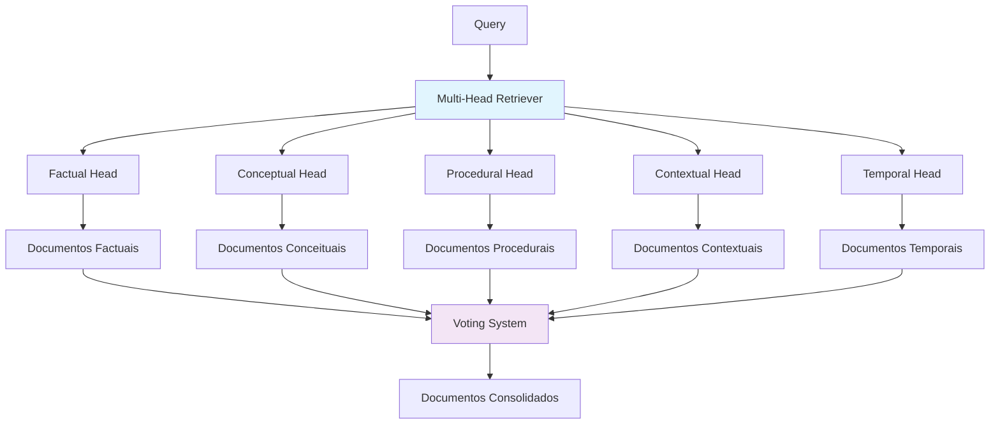
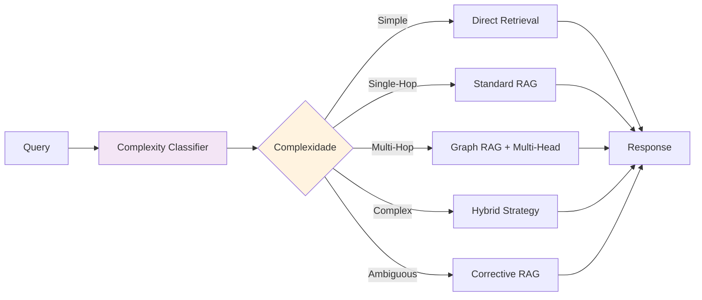
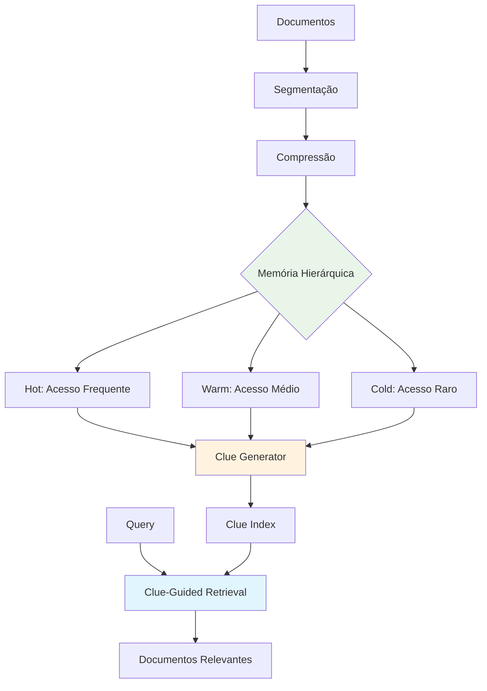

# Guia de Implementação - Funcionalidades Avançadas de RAG

## 🧠 **Multi-Head RAG** | 🎯 **Adaptive RAG Router** | 📊 **MemoRAG**

### **Status da Implementação**

| Funcionalidade | Status | Arquivos |
|----------------|--------|----------|
| **Multi-Head RAG** | ✅ Implementado | `src/retrieval/multi_head_rag.py` |
| **Adaptive RAG Router** | ✅ Implementado | `src/retrieval/adaptive_rag_router.py` |
| **MemoRAG** | ✅ Implementado | `src/retrieval/memo_rag.py` |

---

## 🧠 **Multi-Head RAG - Múltiplas Perspectivas Semânticas**

### **Visão Geral**
O Multi-Head RAG usa múltiplas "attention heads" especializadas para capturar diferentes aspectos semânticos de uma query, similar ao conceito de multi-head attention em Transformers.

### **Arquitetura**


```mermaid
flowchart TB
    A[Query] --> B[Multi-Head Retriever]
    B --> C1[Factual Head]
    B --> C2[Conceptual Head]
    B --> C3[Procedural Head]
    B --> C4[Contextual Head]
    B --> C5[Temporal Head]
    
    C1 --> D1[Documentos Factuais]
    C2 --> D2[Documentos Conceituais]
    C3 --> D3[Documentos Procedurais]
    C4 --> D4[Documentos Contextuais]
    C5 --> D5[Documentos Temporais]
    
    D1 --> E[Voting System]
    D2 --> E
    D3 --> E
    D4 --> E
    D5 --> E
    
    E --> F[Documentos Consolidados]
    
    style B fill:#e1f5fe
    style E fill:#f3e5f5
```

### **Implementação**

```python
from src.retrieval.multi_head_rag import create_multi_head_retriever

# Criar Multi-Head Retriever
multi_head = create_multi_head_retriever(
    embedding_service=embedding_service,
    vector_store=vector_store,
    config={
        "num_heads": 5,
        "attention_dim": 768,
        "voting_strategy": "weighted_majority"  # ou "borda_count", "coverage_optimization"
    }
)

# Realizar busca multi-head
documents, metadata = await multi_head.retrieve_multi_head(
    query="Como implementar autenticação JWT em Python?",
    k=10
)

# Metadados incluem:
# - voting_details: como os documentos foram selecionados
# - diversity_score: quão diversos são os resultados
# - semantic_coverage: cobertura de cada head
```

### **Heads Especializadas**

| Head | Foco Semântico | Uso Ideal |
|------|----------------|-----------|
| **Factual** | Fatos, dados objetivos | Queries diretas ("O que é...") |
| **Conceptual** | Conceitos, definições | Queries teóricas |
| **Procedural** | Processos, tutoriais | Queries "Como fazer..." |
| **Contextual** | Contexto, relações | Queries complexas |
| **Temporal** | Sequências, cronologia | Queries temporais |

### **Estratégias de Voting**

1. **Weighted Majority**: Pondera votos por importância da head
2. **Borda Count**: Sistema de ranking por posição
3. **Coverage Optimization**: Maximiza diversidade semântica

---

## 🎯 **Adaptive RAG Router - Roteamento Inteligente**

### **Visão Geral**
Classifica automaticamente a complexidade de queries e roteia para a estratégia RAG mais apropriada, otimizando performance e recursos.

### **Classificação de Complexidade**

```python
class QueryComplexity(Enum):
    SIMPLE = "simple"              # Resposta direta
    SINGLE_HOP = "single_hop"      # Uma conexão
    MULTI_HOP = "multi_hop"        # Múltiplas conexões
    COMPLEX = "complex"            # Análise profunda
    AMBIGUOUS = "ambiguous"        # Precisa clarificação
```

### **Fluxo de Roteamento**


```mermaid
flowchart LR
    A[Query] --> B[Complexity Classifier]
    B --> C{Complexidade}
    
    C -->|Simple| D[Direct Retrieval]
    C -->|Single-Hop| E[Standard RAG]
    C -->|Multi-Hop| F[Graph RAG + Multi-Head]
    C -->|Complex| G[Hybrid Strategy]
    C -->|Ambiguous| H[Corrective RAG]
    
    D --> I[Response]
    E --> I
    F --> I
    G --> I
    H --> I
    
    style B fill:#f3e5f5
    style C fill:#fff3e0
```

### **Implementação**

```python
from src.retrieval.adaptive_rag_router import create_adaptive_router

# Configurar componentes RAG disponíveis
rag_components = {
    "simple_retriever": simple_retriever,
    "standard_rag": standard_rag,
    "multi_query_rag": multi_query_rag,
    "corrective_rag": corrective_rag,
    "graph_rag": graph_rag,
    "multi_head_rag": multi_head_rag
}

# Criar router adaptativo
router = create_adaptive_router(
    rag_components=rag_components,
    optimization="balanced"  # ou "speed", "accuracy", "cost"
)

# Processar query com roteamento automático
result = await router.route_query(
    "Compare as arquiteturas de microserviços e monolítica considerando escalabilidade e manutenção"
)

# Resultado inclui:
# - complexity: "complex"
# - strategies_used: ["graph", "multi_head"]
# - reasoning_type: "comparative"
```

### **Otimização por Objetivo**

| Objetivo | Características |
|----------|-----------------|
| **Speed** | Reduz K, desabilita reranking, usa métodos simples |
| **Accuracy** | Aumenta K, múltiplas estratégias, reranking |
| **Cost** | Minimiza chamadas LLM, evita métodos caros |
| **Balanced** | Equilibra performance e qualidade |

---

## 📊 **MemoRAG - Memória Global com Contextos Ultra-Longos**

### **Visão Geral**
MemoRAG mantém uma memória global comprimida de até 2M tokens, gerando "clues" para guiar retrieval e suportando contextos massivos.

### **Arquitetura de Memória**


```mermaid
flowchart TB
    A[Documentos] --> B[Segmentação]
    B --> C[Compressão]
    C --> D{Memória Hierárquica}
    
    D --> E[Hot: Acesso Frequente]
    D --> F[Warm: Acesso Médio]
    D --> G[Cold: Acesso Raro]
    
    E --> H[Clue Generator]
    F --> H
    G --> H
    
    H --> I[Clue Index]
    
    J[Query] --> K[Clue-Guided Retrieval]
    I --> K
    K --> L[Documentos Relevantes]
    
    style D fill:#e8f5e8
    style H fill:#fff3e0
    style K fill:#e1f5fe
```

### **Implementação**

```python
from src.retrieval.memo_rag import create_memo_rag

# Criar MemoRAG
memo_rag = create_memo_rag(
    embedding_service=embedding_service,
    llm_service=llm_service,
    config={
        "max_memory_tokens": 2_000_000,  # 2M tokens
        "clue_guided_retrieval": True,
        "memory_persistence_path": "storage/memo_rag.pkl"
    }
)

# Adicionar documento à memória
result = await memo_rag.add_document(
    document=long_document,
    metadata={"source": "technical_manual"},
    importance=0.8
)

# Query com memória global
response = await memo_rag.query_with_memory(
    query="Como configurar clustering no Kubernetes?",
    k=10,
    use_clues=True
)

# Stats da memória
stats = memo_rag.get_stats()
# Inclui: total_tokens, compression_ratio, memory_levels
```

### **Funcionalidades Chave**

1. **Compressão Inteligente**
   - Compressão automática de segmentos grandes
   - Taxa de compressão típica: 3-5x
   - Descompressão on-demand

2. **Hierarquia de Memória**
   - **Hot**: Documentos recentes/frequentes (não comprimidos)
   - **Warm**: Acesso médio (parcialmente comprimidos)
   - **Cold**: Raramente acessados (máxima compressão)

3. **Geração de Clues**
   ```python
   # Tipos de clues geradas automaticamente:
   - Keywords: Palavras-chave importantes
   - Concepts: Conceitos principais
   - Entities: Pessoas, lugares, organizações
   - Relations: Sujeito -> Relação -> Objeto
   - Questions: Perguntas que o conteúdo responde
   ```

4. **Eviction Inteligente**
   - Score baseado em: importância, idade, frequência
   - Preserva documentos críticos
   - Libera espaço automaticamente

---

## 🔧 **Integração com Pipeline RAG**

### **Modificar Pipeline Existente**

```python
# src/rag_pipeline_advanced.py

from src.retrieval.multi_head_rag import create_multi_head_retriever
from src.retrieval.adaptive_rag_router import create_adaptive_router
from src.retrieval.memo_rag import create_memo_rag

class AdvancedRAGPipeline:
    def __init__(self, config):
        super().__init__(config)
        
        # Inicializar novos componentes
        self.multi_head = create_multi_head_retriever(
            self.embedding_service,
            self.vector_store
        )
        
        # Router adaptativo com todos os componentes
        self.adaptive_router = create_adaptive_router({
            "simple_retriever": self.retriever,
            "standard_rag": self,
            "multi_query_rag": self.multi_query_rag,
            "corrective_rag": self.corrective_rag,
            "graph_rag": self.graph_enhancer,
            "multi_head_rag": self.multi_head
        })
        
        # MemoRAG para contextos longos
        self.memo_rag = create_memo_rag(
            self.embedding_service,
            self.llm_service
        )
    
    async def query_advanced(self, question: str, **kwargs):
        # Usar router adaptativo por padrão
        if kwargs.get("use_adaptive_routing", True):
            return await self.adaptive_router.route_query(question, **kwargs)
        
        # Ou usar método específico
        method = kwargs.get("method", "standard")
        
        if method == "multi_head":
            docs, metadata = await self.multi_head.retrieve_multi_head(question)
            # Gerar resposta...
        elif method == "memo_rag":
            return await self.memo_rag.query_with_memory(question)
        else:
            return await super().query(question, **kwargs)
```

### **Configuração YAML**

```yaml
# config/advanced_rag_features.yaml

multi_head_rag:
  enabled: true
  num_heads: 5
  attention_dim: 768
  voting_strategy: "weighted_majority"
  head_weights:
    factual: 1.2
    conceptual: 1.0
    procedural: 1.1
    contextual: 0.9
    temporal: 0.8

adaptive_router:
  enabled: true
  optimization_objective: "balanced"
  complexity_thresholds:
    simple_word_count: 5
    complex_entity_count: 3
  routing_rules:
    simple:
      strategies: ["direct"]
      max_time: 2.0
    complex:
      strategies: ["hybrid", "multi_head"]
      max_time: 15.0

memo_rag:
  enabled: true
  max_memory_tokens: 2000000
  compression_threshold: 10000
  clue_guided_retrieval: true
  memory_levels:
    hot_capacity: 100000
    warm_capacity: 500000
    cold_capacity: 1400000
  persistence:
    enabled: true
    path: "storage/memo_rag_memory.pkl"
    auto_save_interval: 3600  # 1 hora
```

---

## 📊 **Comparação de Funcionalidades**

| Aspecto | Multi-Head RAG | Adaptive Router | MemoRAG |
|---------|---------------|-----------------|---------|
| **Foco Principal** | Diversidade semântica | Otimização de recursos | Contextos massivos |
| **Melhor Para** | Queries complexas | Todas as queries | Bases grandes |
| **Overhead** | Médio | Baixo | Alto (memória) |
| **Latência** | ~2-3x standard | ~1.1x standard | ~1.5x standard |
| **Precisão** | Alta | Variável | Muito alta |

---

## 🧪 **Testes e Validação**

### **Test Multi-Head RAG**

```python
async def test_multi_head():
    query = "Explain machine learning with examples"
    
    # Testar diversidade
    docs, metadata = await multi_head.retrieve_multi_head(query, k=10)
    
    assert metadata["diversity_score"] > 0.5
    assert len(metadata["head_contributions"]) == 5
    print(f"Diversity: {metadata['diversity_score']:.3f}")
    print(f"Coverage: {metadata['semantic_coverage']}")
```

### **Test Adaptive Router**

```python
async def test_adaptive_routing():
    queries = [
        ("What is Python?", QueryComplexity.SIMPLE),
        ("How does garbage collection work?", QueryComplexity.SINGLE_HOP),
        ("Compare REST vs GraphQL architectures", QueryComplexity.COMPLEX)
    ]
    
    for query, expected in queries:
        result = await router.route_query(query)
        actual = result["routing_metadata"]["complexity"]
        print(f"Query: {query[:30]}... -> {actual}")
```

### **Test MemoRAG**

```python
async def test_memo_rag():
    # Adicionar documentos grandes
    for doc in large_documents:
        await memo_rag.add_document(doc)
    
    # Verificar capacidade
    stats = memo_rag.get_stats()
    print(f"Total tokens: {stats['memory_stats']['total_tokens']:,}")
    print(f"Compression: {stats['memory_stats']['compression']['compression_ratio']:.1f}x")
    
    # Query com clues
    result = await memo_rag.query_with_memory(
        "Technical details about distributed systems",
        use_clues=True
    )
```

---

## 🚀 **Próximos Passos**

### **1. Implementação Gradual**
```bash
# Fase 1: Testar individualmente
python -m src.retrieval.multi_head_rag --test
python -m src.retrieval.adaptive_rag_router --test
python -m src.retrieval.memo_rag --test

# Fase 2: Integrar com pipeline
python scripts/integrate_advanced_features.py

# Fase 3: Benchmarks
python benchmarks/advanced_rag_performance.py
```

### **2. Otimizações Futuras**

- **Multi-Head**: Aprender pesos das heads com feedback
- **Adaptive Router**: ML para classificação de complexidade
- **MemoRAG**: Índices vetoriais para 10M+ tokens

### **3. Monitoramento**

```python
# Métricas essenciais
metrics = {
    "multi_head": {
        "diversity_score": 0.75,
        "head_utilization": {...}
    },
    "adaptive_router": {
        "routing_accuracy": 0.85,
        "optimization_savings": "30%"
    },
    "memo_rag": {
        "memory_utilization": 0.45,
        "clue_effectiveness": 0.82
    }
}
```

---

## 🎯 **Conclusão**

As três funcionalidades avançadas fornecem capacidades complementares:

- **Multi-Head RAG**: Melhor compreensão semântica
- **Adaptive Router**: Eficiência otimizada
- **MemoRAG**: Escala massiva

Juntas, elas elevam o sistema RAG a um nível enterprise-ready com performance e capacidades state-of-the-art. 