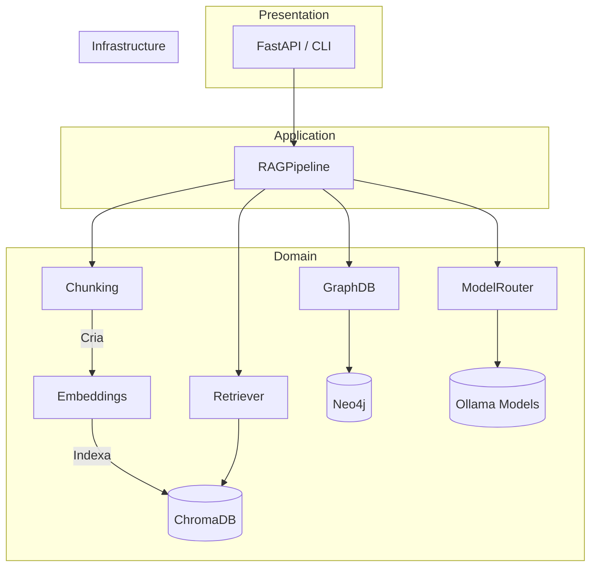

# Arquitetura do Projeto RAG Multimodelo

Este documento aprofunda a arquitetura interna do sistema, cobrindo componentes, padrões de design e fluxos de dados.

---

## 1. Visão em Camadas

### 1.1 Padrões Aplicados

* **Hexagonal Architecture (Ports & Adapters)** – Componentes de infraestrutura (ChromaDB, Neo4j, Ollama) ficam desacoplados via classes de serviço.
* **Clean Code / SRP** – Cada classe possui responsabilidade única.
* **Strategy Pattern** – `SemanticChunker` × `RecursiveChunker`.
* **Factory / Router** – `ModelRouter` decide qual modelo utilizar.

---

## 2. Componentes Principais

| Camada | Classe | Responsabilidade |
|--------|--------|------------------|
| Application | `RAGPipeline` | Orquestra chunking, retrieval, grafo e LLM. |
| Domain | `HybridRetriever` | Combina busca vetorial + reranking. |
| Domain | `Neo4jStore` | Abstrai transações Cypher. |
| Domain | `ChromaVectorStore` | Operações CRUD em ChromaDB. |
| Domain | `ModelRouter` / `AdvancedModelRouter` | Estratégias de roteamento. |
| Domain | `GraphNode`, `GraphRelation` | Modelos de grafo. |
| Infrastructure | Ollama Client | Interface HTTP p/ modelos. |

---

## 3. Fluxo de Consulta Detalhado

1. **Entrada**: Usuário envia pergunta.
2. `RAGPipeline.query`:
   1. Gera embedding da query.
   2. `HybridRetriever` busca `k` chunks similares.
   3. Se habilitado, `Neo4jStore` expande contexto via grafo.
   4. `ModelRouter` escolhe modelo(s) LLM.
   5. Monta prompt contendo contexto.
   6. Envia para Ollama, recebe resposta.
   7. Retorna JSON com resposta, fontes, modelos, etc.

---

## 4. Extensões Futuras

* Suporte a outros bancos vetoriais (Milvus, Weaviate) – criar nova classe em `src/vectordb` seguindo interface.
* Indexação incremental com detecção de alterações via hashing.
* Cache de consultas em Redis.
* Monitoramento Prometheus + Grafana.

---

## 5. Decision Log (ADR Resumido)

| ID | Decisão | Data |
|----|---------|------|
| 001 | ChromaDB como vetordb local simples | 2024-05-18 |
| 002 | Neo4j p/ representar relações semânticas | 2024-05-19 |
| 003 | Ollama (modelos locais) p/ reduzir custo API | 2024-05-20 |

---

**Autor:** Equipe IA – 2024 