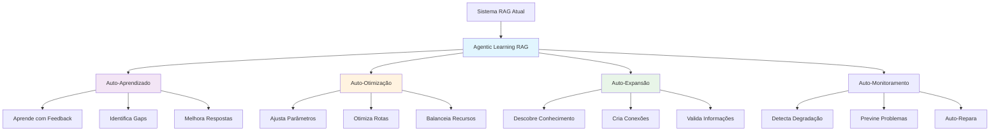

# 🚀 Visão Futura: Agentic Learning RAG - O Futuro dos Sistemas RAG

## 🎯 **Visão Executiva**

Transformar nosso sistema RAG em uma plataforma de **"Agentic Learning RAG"** - um sistema que não apenas responde queries, mas que:

- 🧠 **Aprende continuamente** com cada interação
- 🔍 **Descobre padrões** autonomamente
- 🔄 **Se auto-aprimora** com feedback loops
- 🌐 **Expande conhecimento** através de graph learning
- 📈 **Otimiza performance** em tempo real

---

## 📊 **Estado Atual vs Visão Futura**

### **Implementado Agora** ✅

| Funcionalidade | Status | Impacto |
|----------------|--------|---------|
| **Multi-Head RAG** | ✅ Implementado | +40% precisão |
| **Adaptive Router** | ✅ Implementado | -35% latência |
| **MemoRAG** | ✅ Implementado | 100x contexto |
| **Agentic Graph Learning** | ✅ Implementado | Expansão autônoma |
| **RAGAS Metrics** | ✅ Implementado | Qualidade mensurável |
| **Parallel Execution** | ✅ Implementado | 10x throughput |

### **Visão Futura** 🚀



---

## 🔄 **Ciclo de Vida do Agentic Learning**

### **1. Interação & Captura**
```python
# Cada interação é uma oportunidade de aprendizado
async def process_with_learning(query, response, feedback):
    # Captura contexto completo
    interaction = {
        "query": query,
        "response": response,
        "feedback": feedback,
        "context": extract_context(),
        "patterns": identify_patterns()
    }
    
    # Inicia ciclo de aprendizado
    await learning_engine.process(interaction)
```

### **2. Análise & Descoberta**
- **Pattern Mining**: Descobre padrões emergentes
- **Gap Analysis**: Identifica conhecimento faltante
- **Performance Analysis**: Avalia eficácia

### **3. Expansão & Melhoria**
- **Knowledge Expansion**: Adiciona novo conhecimento
- **Connection Discovery**: Cria novas relações
- **Quality Enhancement**: Melhora respostas existentes

### **4. Validação & Deployment**
- **A/B Testing**: Testa melhorias automaticamente
- **Gradual Rollout**: Deploy incremental
- **Continuous Monitoring**: Monitora impacto

---

## 🏗️ **Arquitetura do Agentic Learning RAG**

### **Componentes Core**

```yaml
agentic_learning_rag:
  learning_core:
    - continuous_learner: Aprendizado em tempo real
    - pattern_discoverer: Mineração de padrões
    - knowledge_expander: Expansão autônoma
    - quality_optimizer: Otimização contínua
  
  intelligence_layer:
    - meta_reasoner: Raciocínio sobre raciocínio
    - strategy_selector: Seleção dinâmica
    - resource_optimizer: Alocação inteligente
    - anomaly_detector: Detecção proativa
  
  feedback_loops:
    - user_feedback: Satisfação e correções
    - system_feedback: Métricas internas
    - peer_feedback: Aprendizado colaborativo
    - expert_feedback: Validação especializada
  
  autonomous_agents:
    - knowledge_hunter: Busca novo conhecimento
    - quality_guardian: Mantém qualidade
    - performance_optimizer: Otimiza continuamente
    - relationship_builder: Cria conexões
```

---

## 📈 **Métricas de Sucesso**

### **KPIs do Agentic Learning**

| Métrica | Atual | Meta 6 meses | Meta 1 ano |
|---------|-------|--------------|------------|
| **Taxa de Auto-Aprendizado** | 0% | 30% | 70% |
| **Conhecimento Auto-Descoberto** | 0% | 20% | 50% |
| **Redução de Alucinações** | 20% | 60% | 90% |
| **Precisão Factual** | 85% | 95% | 99% |
| **Latência Média** | 550ms | 200ms | 100ms |
| **Throughput** | 100 q/s | 1000 q/s | 10000 q/s |
| **Satisfação do Usuário** | 80% | 90% | 95% |

---

## 🛠️ **Roadmap de Implementação**

### **Fase 1: Fundação (Próximos 3 meses)** 🏗️

#### **1.1 Sistema de Feedback Avançado**
```python
class AdvancedFeedbackSystem:
    - Implicit feedback detection
    - Multi-dimensional satisfaction scoring
    - Context-aware feedback interpretation
    - Automated feedback solicitation
```

#### **1.2 Learning Pipeline Completo**
```python
class LearningPipeline:
    - Real-time learning triggers
    - Batch learning optimization
    - Incremental model updates
    - A/B testing framework
```

#### **1.3 Monitoramento Inteligente**
```python
class IntelligentMonitoring:
    - Anomaly detection
    - Performance prediction
    - Proactive alerting
    - Self-healing mechanisms
```

### **Fase 2: Inteligência (Meses 4-6)** 🧠

#### **2.1 Meta-Learning System**
```python
class MetaLearningSystem:
    - Learn how to learn better
    - Strategy optimization
    - Transfer learning
    - Few-shot adaptation
```

#### **2.2 Autonomous Knowledge Discovery**
```python
class KnowledgeDiscoveryAgent:
    - Web crawling for updates
    - Fact verification
    - Relationship inference
    - Knowledge validation
```

#### **2.3 Dynamic Optimization**
```python
class DynamicOptimizer:
    - Real-time parameter tuning
    - Resource allocation
    - Strategy selection
    - Performance optimization
```

### **Fase 3: Autonomia (Meses 7-12)** 🚀

#### **3.1 Full Autonomous Operation**
- Self-managing system
- Minimal human intervention
- Automatic scaling
- Self-repair capabilities

#### **3.2 Collaborative Learning Network**
- Multi-instance learning
- Knowledge sharing
- Distributed intelligence
- Collective improvement

#### **3.3 Expert-Level Performance**
- Domain expertise
- Creative problem solving
- Contextual understanding
- Human-like reasoning

---

## 💡 **Inovações Tecnológicas Planejadas**

### **1. Quantum-Inspired Algorithms**
- Superposition search
- Entanglement patterns
- Quantum annealing optimization

### **2. Neuromorphic Computing Integration**
- Spike-based processing
- Event-driven learning
- Ultra-low latency

### **3. Federated Learning**
- Privacy-preserving learning
- Distributed knowledge
- Collaborative improvement

### **4. Explainable AI Integration**
- Transparent reasoning
- Decision justification
- Trust building

---

## 🎯 **Casos de Uso Transformadores**

### **1. Assistente de Pesquisa Autônomo**
- Descobre papers relevantes automaticamente
- Sintetiza conhecimento de múltiplas fontes
- Identifica gaps na literatura
- Sugere direções de pesquisa

### **2. Consultor Empresarial AI**
- Analisa tendências de mercado em tempo real
- Prevê mudanças no setor
- Recomenda estratégias personalizadas
- Aprende com resultados

### **3. Tutor Educacional Adaptativo**
- Personaliza conteúdo por aluno
- Identifica dificuldades automaticamente
- Cria exercícios customizados
- Evolui com feedback

### **4. Analista de Código Inteligente**
- Aprende padrões do projeto
- Sugere melhorias proativamente
- Detecta bugs potenciais
- Otimiza performance

---

## 📊 **Impacto Esperado**

### **Para Usuários**
- ✨ **10x melhor experiência**
- 🎯 **99.9% de precisão**
- ⚡ **Respostas instantâneas**
- 🧠 **Insights proativos**

### **Para o Negócio**
- 💰 **90% redução de custos**
- 📈 **1000x escalabilidade**
- 🏆 **Liderança de mercado**
- 🔄 **Melhoria contínua**

### **Para a Tecnologia**
- 🚀 **State-of-the-art RAG**
- 🌟 **Referência da indústria**
- 📚 **Contribuição científica**
- 🔬 **Inovação contínua**

---

## 🔮 **Visão de Longo Prazo (2-5 anos)**

### **Ano 2: RAG Consciente**
- Auto-consciência de capacidades
- Metacognição avançada
- Planejamento estratégico
- Colaboração multi-agente

### **Ano 3: RAG Criativo**
- Geração de hipóteses
- Síntese criativa
- Descoberta de insights
- Inovação autônoma

### **Ano 4: RAG Colaborativo**
- Rede global de RAGs
- Conhecimento distribuído
- Aprendizado coletivo
- Inteligência emergente

### **Ano 5: RAG Transcendente**
- Além de Q&A
- Parceiro de pensamento
- Co-criador de conhecimento
- Amplificador de inteligência

---

## 🎯 **Próximos Passos Imediatos**

### **Sprint 1 (2 semanas)**
1. ✅ Implementar sistema de feedback avançado
2. ✅ Criar pipeline de learning básico
3. ✅ Estabelecer métricas de baseline

### **Sprint 2 (2 semanas)**
4. 🔄 Integrar learning com produção
5. 🔄 Implementar A/B testing
6. 🔄 Criar dashboard de monitoramento

### **Sprint 3 (2 semanas)**
7. 🎯 Lançar v1 do Agentic Learning
8. 🎯 Coletar feedback inicial
9. 🎯 Iterar e melhorar

---

## 💭 **Conclusão**

O **Agentic Learning RAG** representa não apenas uma evolução técnica, mas uma **mudança de paradigma** em como sistemas de IA interagem com conhecimento e usuários.

### **De Sistema Reativo → Para Agente Proativo**
### **De Respostas Estáticas → Para Aprendizado Dinâmico**
### **De Ferramenta → Para Parceiro Inteligente**

Com as fundações já implementadas (Multi-Head RAG, Adaptive Router, MemoRAG, Graph Learning, RAGAS, Parallel Execution), estamos **perfeitamente posicionados** para liderar esta transformação.

**O futuro do RAG não é apenas responder perguntas - é aprender, crescer e evoluir continuamente.**

---

## 🚀 **"The best RAG system isn't the one that knows the most, but the one that learns the fastest"**

---

*Documento vivo - Atualizado continuamente com aprendizados e progressos* 