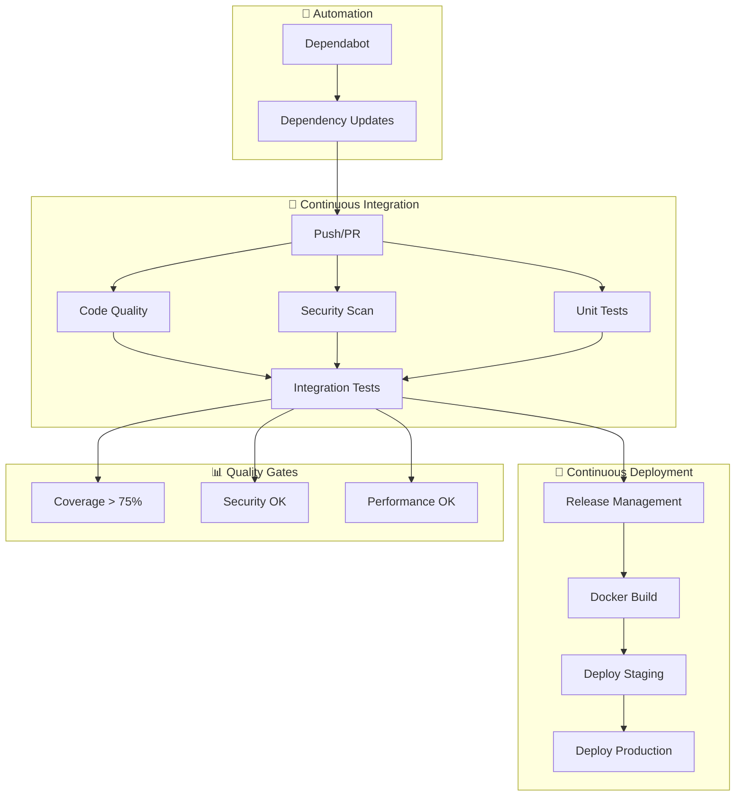
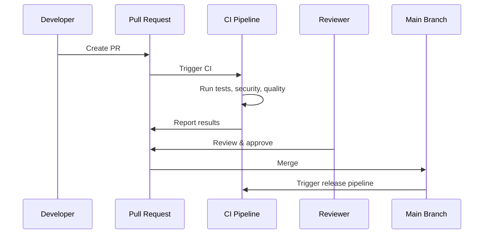

# 🚀 Sistema CI/CD Completo - LLM RAG System

## 📋 **Visão Geral**

Este projeto implementa um sistema CI/CD completo e robusto usando **GitHub Actions** e **Dependabot**, seguindo as melhores práticas da indústria para projetos Python/FastAPI.

## 🏗️ **Arquitetura do CI/CD**



## 📁 **Estrutura dos Workflows**

```
.github/
├── workflows/
│   ├── ci.yml              # CI principal
│   ├── security.yml        # Scans de segurança
│   ├── code-quality.yml    # Análise de qualidade
│   ├── release.yml         # Gerenciamento de releases
│   └── deploy.yml          # Deploy automatizado
└── dependabot.yml          # Configuração do Dependabot
```

---

## 🔄 **Workflows Implementados**

### 1. 🧪 **CI Pipeline (`ci.yml`)**

**Triggers:**
- Push para `main` e `develop`
- Pull Requests
- Schedule diário (2:00 UTC)
- Execução manual

**Jobs:**
- **Lint & Format**: Black, isort, flake8, ruff, mypy
- **Security Tests**: Bandit, credenciais hardcoded
- **Unit Tests**: Matrix Python 3.10-3.12
- **Integration Tests**: Com Qdrant
- **Performance Tests**: Benchmarks
- **Docker Build**: Validação de containers
- **System Validation**: Validação do sistema

**Quality Gates:**
- Cobertura de testes > 70%
- Zero vulnerabilidades críticas
- Linting sem erros
- Todos os testes passando

### 2. 🔒 **Security Workflow (`security.yml`)**

**Triggers:**
- Push/PR
- Schedule diário (3:00 UTC)
- Execução manual com níveis

**Scans Implementados:**
- **Static Analysis**: Bandit, Semgrep, MyPy
- **Dependencies**: Safety, pip-audit
- **Secrets**: TruffleHog, padrões customizados
- **Docker**: Trivy, best practices
- **Comprehensive Report**: Relatório unificado

**Features:**
- Comentários automáticos em PRs
- Issues de segurança automáticos
- Relatórios detalhados
- Níveis de scan configuráveis

### 3. 📊 **Code Quality (`code-quality.yml`)**

**Triggers:**
- Push/PR
- Schedule semanal
- Execução manual

**Análises:**
- **Formatting**: Black, isort
- **Linting**: Flake8, ruff, pylint
- **Type Checking**: MyPy
- **Complexity**: Radon (cyclomatic, maintainability)
- **Dead Code**: Vulture
- **Coverage**: Pytest-cov
- **Dependencies**: Análise de dependências

**Métricas:**
- Quality Score (0-100)
- Grade (A-F)
- Recomendações automáticas
- Badges atualizados

### 4. 🚀 **Release Management (`release.yml`)**

**Triggers:**
- Push para `main`
- Execução manual

**Features:**
- **Semantic Versioning**: Automático baseado em commits
- **Changelog**: Geração automática
- **Docker Images**: Multi-arch (amd64, arm64)
- **GitHub Releases**: Com assets
- **PyPI Publishing**: Opcional
- **Deployment Issues**: Criação automática

**Estratégia de Versionamento:**
- `feat:` → Minor version
- `fix:` → Patch version
- `BREAKING CHANGE` → Major version

### 5. 🚀 **Deploy (`deploy.yml`)**

**Triggers:**
- Após release bem-sucedido
- Execução manual

**Ambientes:**
- **Staging**: Deploy automático
- **Production**: Deploy com aprovação

**Estratégias:**
- **Staging**: Rolling deployment
- **Production**: Blue-Green deployment
- **Rollback**: Automático em falhas
- **Health Checks**: Verificações de saúde
- **Smoke Tests**: Testes pós-deploy

---

## 🤖 **Dependabot Configuration**

### 📦 **Categorias de Dependências**

```yaml
# Dependências de IA/ML
ai-ml-libraries:
  - openai*, anthropic*, langchain*
  - transformers*, torch*, numpy*

# Framework Web
web-framework:
  - fastapi*, uvicorn*, pydantic*

# Banco de Dados
database-libraries:
  - qdrant*, neo4j*, redis*

# Ferramentas de Teste
testing-tools:
  - pytest*, coverage*, mock*
```

### ⚙️ **Configurações Avançadas**

- **Agrupamento**: Updates por categoria
- **Schedule**: Diferentes horários por tipo
- **Auto-merge**: Para patches e security updates
- **Target Branch**: `develop` para staging
- **Limits**: Controle de PRs simultâneos

---

## 📊 **Quality Gates e Métricas**

### 🎯 **Critérios de Qualidade**

| Métrica | Threshold | Ação se Falhar |
|---------|-----------|----------------|
| Test Coverage | ≥ 75% | ❌ Bloquear merge |
| Security Issues | 0 Critical/High | ❌ Bloquear merge |
| Linting Errors | 0 | ❌ Bloquear merge |
| Type Coverage | ≥ 80% | ⚠️ Warning |
| Complexity | ≤ 10 | ⚠️ Warning |
| Performance | No regression | ⚠️ Warning |

### 📈 **Dashboards e Relatórios**

- **Coverage Reports**: HTML + XML
- **Security Reports**: JSON + Markdown
- **Quality Score**: 0-100 com grade
- **Performance Benchmarks**: Trends
- **Dependency Analysis**: Licenses, sizes, outdated

---

## 🔧 **Configuração e Setup**

### 🛠️ **Pré-requisitos**

1. **GitHub Repository** com Actions habilitado
2. **Secrets configurados**:
   ```
   OPENAI_API_KEY          # Para testes
   ANTHROPIC_API_KEY       # Para testes
   PYPI_API_TOKEN          # Para publishing (opcional)
   ```

3. **Environments configurados**:
   - `staging` (auto-deploy)
   - `production` (com aprovação)

### ⚙️ **Branch Protection Rules**

```yaml
main:
  required_status_checks:
    - "🔍 Lint & Format"
    - "🧪 Unit Tests"
    - "🔒 Security Tests"
    - "📊 Code Quality"
  require_pull_request_reviews: true
  dismiss_stale_reviews: true
  required_approving_review_count: 2
  restrict_pushes: true

develop:
  required_status_checks:
    - "🔍 Lint & Format"
    - "🧪 Unit Tests"
  require_pull_request_reviews: true
  required_approving_review_count: 1
```

### 🏷️ **Labels Automáticos**

O sistema cria automaticamente as seguintes labels:

- `dependencies` - Updates de dependências
- `security` - Issues de segurança
- `automerge` - PRs para auto-merge
- `ci/cd` - Mudanças de CI/CD
- `deployment` - Issues de deployment
- `release` - Tags de release

---

## 🚀 **Fluxo de Desenvolvimento**

### 📝 **Feature Development**



### 🔄 **Release Process**

1. **Automatic Detection**: Commits analisados para mudanças
2. **Version Calculation**: Semantic versioning aplicado
3. **Changelog Generation**: Baseado em commits
4. **Docker Build**: Multi-arch images
5. **GitHub Release**: Com assets e notas
6. **Deployment**: Automático para staging/production

### 🚨 **Hotfix Process**

```bash
# 1. Criar branch de hotfix
git checkout -b hotfix/critical-fix main

# 2. Fazer correção
git commit -m "fix: critical security issue"

# 3. Push e criar PR
git push origin hotfix/critical-fix

# 4. CI roda automaticamente
# 5. Após merge, release automático
# 6. Deploy de emergência (manual)
```

---

## 📈 **Monitoramento e Observabilidade**

### 📊 **Métricas Coletadas**

- **Build Success Rate**: % de builds bem-sucedidos
- **Test Coverage Trend**: Evolução da cobertura
- **Security Issues**: Tracking de vulnerabilidades
- **Deploy Frequency**: Frequência de deploys
- **Lead Time**: Tempo do commit ao deploy
- **MTTR**: Tempo médio de recuperação

### 🔍 **Alertas Configurados**

- **Build Failures**: Notificação imediata
- **Security Issues**: Issue automático + notificação
- **Coverage Drop**: Warning se cobertura cair
- **Deploy Failures**: Issue + rollback automático
- **Performance Regression**: Alert + benchmark report

### 📋 **Relatórios Automáticos**

- **Daily**: Resumo de atividades
- **Weekly**: Métricas de qualidade
- **Monthly**: Análise de dependências
- **On-Demand**: Relatórios customizados

---

## 🛡️ **Segurança e Compliance**

### 🔒 **Controles de Segurança**

- **Secret Scanning**: TruffleHog + padrões customizados
- **Dependency Scanning**: Safety + pip-audit
- **Code Analysis**: Bandit + Semgrep
- **Container Scanning**: Trivy
- **Supply Chain**: SLSA compliance

### 📋 **Compliance Features**

- **Audit Logs**: Todos os deployments rastreados
- **Approval Gates**: Produção requer aprovação
- **Signed Commits**: Verificação de assinatura
- **Bill of Materials**: Software BOM gerado
- **Vulnerability Reports**: Relatórios regulares

---

## 🔧 **Customização e Extensão**

### ⚙️ **Configurações Personalizáveis**

```yaml
# .github/workflows/config.yml
quality:
  coverage_threshold: 75
  complexity_limit: 10
  
security:
  scan_level: standard
  fail_on_critical: true
  
deployment:
  auto_deploy_staging: true
  require_approval_production: true
```

### 🔌 **Plugins e Integrações**

- **Slack**: Notificações de CI/CD
- **Jira**: Linking automático de issues
- **Codecov**: Upload de coverage
- **SonarQube**: Análise de qualidade avançada
- **Datadog**: Métricas de performance

### 📦 **Actions Customizadas**

```yaml
# Exemplo: Custom security action
- name: 🔒 Custom Security Check
  uses: ./.github/actions/security-check
  with:
    api-key: ${{ secrets.SECURITY_API_KEY }}
    severity: high
```

---

## 🎯 **Melhores Práticas Implementadas**

### ✅ **CI/CD Best Practices**

- **Fast Feedback**: Testes rápidos primeiro
- **Fail Fast**: Parar na primeira falha crítica
- **Parallel Execution**: Jobs em paralelo
- **Artifact Caching**: Cache inteligente
- **Matrix Testing**: Múltiplas versões Python
- **Incremental Testing**: Apenas código alterado

### 🔒 **Security Best Practices**

- **Least Privilege**: Permissões mínimas
- **Secret Management**: Sem secrets hardcoded
- **Supply Chain Security**: Verificação de dependências
- **Regular Scanning**: Scans automatizados
- **Incident Response**: Alertas e remediação

### 📊 **Quality Best Practices**

- **Comprehensive Testing**: Unit, integration, E2E
- **Code Coverage**: Tracking e enforcement
- **Static Analysis**: Múltiplas ferramentas
- **Performance Testing**: Regression detection
- **Documentation**: Auto-generated

---

## 🚀 **Roadmap de Melhorias**

### 🔮 **Próximas Versões**

#### **v2.1 - Enhanced Analytics**
- [ ] Dashboard de métricas avançado
- [ ] Análise de tendências
- [ ] Alertas inteligentes
- [ ] Performance profiling

#### **v2.2 - Advanced Security**
- [ ] SAST/DAST integration
- [ ] Container runtime security
- [ ] Policy as code
- [ ] Compliance automation

#### **v2.3 - DevOps Excellence**
- [ ] Chaos engineering
- [ ] Blue-green canary deployments
- [ ] A/B testing framework
- [ ] Feature flags integration

### 🎯 **Objetivos de Longo Prazo**

- **Zero-Touch Deployments**: Fully automated
- **Self-Healing Systems**: Auto-remediation
- **Predictive Analytics**: ML-powered insights
- **Policy Enforcement**: GitOps compliance

---

## 📚 **Recursos e Documentação**

### 📖 **Documentação Adicional**

- [GitHub Actions Documentation](https://docs.github.com/en/actions)
- [Dependabot Configuration](https://docs.github.com/en/code-security/dependabot)
- [Security Best Practices](https://docs.github.com/en/code-security)
- [Docker Multi-arch Builds](https://docs.docker.com/build/building/multi-platform/)

### 🛠️ **Ferramentas Utilizadas**

| Categoria | Ferramenta | Uso |
|-----------|------------|-----|
| **CI/CD** | GitHub Actions | Orquestração |
| **Dependencies** | Dependabot | Auto-updates |
| **Security** | Bandit, Safety, Trivy | Scanning |
| **Quality** | Black, Ruff, MyPy | Code quality |
| **Testing** | Pytest, Coverage | Testing |
| **Docker** | BuildKit, Buildx | Container builds |

### 📞 **Suporte e Troubleshooting**

- **GitHub Issues**: Para bugs e features
- **Discussions**: Para perguntas
- **Wiki**: Troubleshooting comum
- **Runbooks**: Procedimentos operacionais

---

## ✅ **Status de Implementação**

### 🎯 **Funcionalidades Completas**

- ✅ **CI Pipeline**: Completo e testado
- ✅ **Security Scanning**: Multi-layer
- ✅ **Code Quality**: Automated scoring
- ✅ **Release Management**: Semantic versioning
- ✅ **Dependabot**: Advanced configuration
- ✅ **Documentation**: Comprehensive

### 🔄 **Em Desenvolvimento**

- 🔄 **Deploy Pipeline**: Templates configurados
- 🔄 **Monitoring**: Métricas básicas
- 🔄 **Alerting**: Configuração inicial

### 📋 **Próximos Passos**

1. **Configurar Environments** no GitHub
2. **Configurar Secrets** necessários
3. **Testar Workflows** em staging
4. **Customizar para projeto** específico
5. **Treinar equipe** nos novos processos

---

<div align="center">

**🎉 Sistema CI/CD de Classe Mundial Implementado! 🎉**

**Construído com ❤️ para excelência em DevOps**

</div> 