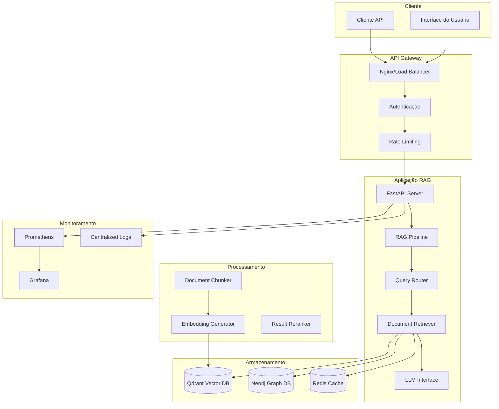
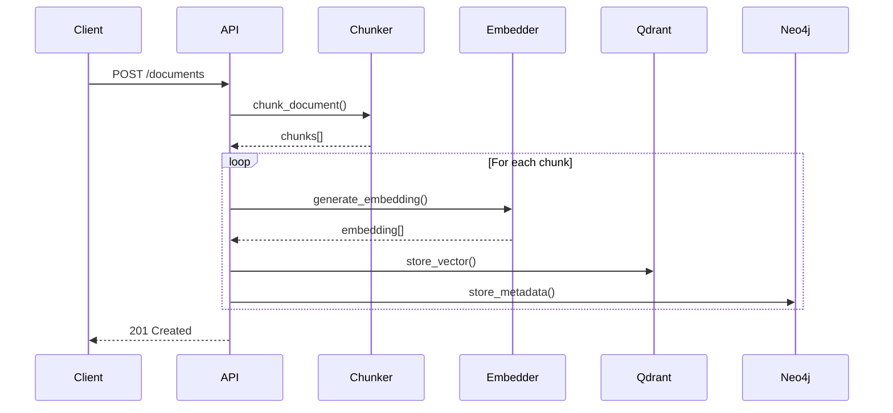
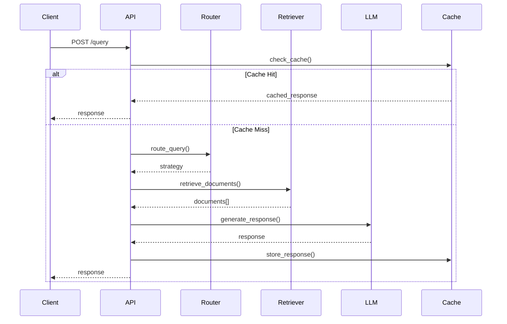

# Documentação Técnica - Sistema RAG

## Índice

1. [Visão Geral da Arquitetura](#visão-geral-da-arquitetura)
2. [Componentes do Sistema](#componentes-do-sistema)
3. [Fluxo de Dados](#fluxo-de-dados)
4. [APIs e Endpoints](#apis-e-endpoints)
5. [Configuração e Deploy](#configuração-e-deploy)
6. [Monitoramento e Observabilidade](#monitoramento-e-observabilidade)
7. [Segurança](#segurança)
8. [Performance e Otimização](#performance-e-otimização)
9. [Troubleshooting](#troubleshooting)
10. [Desenvolvimento](#desenvolvimento)

---

## Visão Geral da Arquitetura

### Arquitetura de Alto Nível



### Princípios Arquiteturais

- **Modularidade**: Componentes independentes e intercambiáveis
- **Escalabilidade**: Suporte a scaling horizontal e vertical
- **Observabilidade**: Métricas, logs e tracing completos
- **Resiliência**: Fallbacks e circuit breakers
- **Segurança**: Autenticação, autorização e criptografia

---

## Componentes do Sistema

### 1. RAG Pipeline (`src/rag_pipeline.py`)

**Responsabilidade**: Orquestração principal do fluxo RAG

```python
class RAGPipeline:
    def __init__(self):
        self.chunker = DocumentChunker()
        self.embedder = EmbeddingGenerator()
        self.retriever = DocumentRetriever()
        self.llm = LLMInterface()
        self.router = QueryRouter()
    
    async def process_query(self, query: str) -> RAGResponse:
        # 1. Route query to appropriate strategy
        strategy = await self.router.route(query)
        
        # 2. Retrieve relevant documents
        documents = await self.retriever.retrieve(
            query, strategy=strategy
        )
        
        # 3. Generate response with LLM
        response = await self.llm.generate(
            query=query,
            context=documents,
            strategy=strategy
        )
        
        return response
```

**Métricas Principais**:
- `rag_pipeline_requests_total`
- `rag_pipeline_duration_seconds`
- `rag_pipeline_errors_total`

### 2. Document Chunker (`src/chunker.py`)

**Responsabilidade**: Divisão inteligente de documentos

**Estratégias de Chunking**:
- **Recursive**: Divisão hierárquica por separadores
- **Semantic**: Baseado em similaridade semântica
- **Fixed**: Tamanho fixo com overlap
- **Adaptive**: Ajuste dinâmico baseado no conteúdo

```python
class DocumentChunker:
    def chunk_document(
        self, 
        document: Document,
        strategy: ChunkingStrategy = ChunkingStrategy.RECURSIVE
    ) -> List[DocumentChunk]:
        if strategy == ChunkingStrategy.SEMANTIC:
            return self._semantic_chunking(document)
        elif strategy == ChunkingStrategy.RECURSIVE:
            return self._recursive_chunking(document)
        # ...
```

### 3. Embedding Generator (`src/embeddings.py`)

**Responsabilidade**: Geração de embeddings vetoriais

**Modelos Suportados**:
- Sentence Transformers (local)
- OpenAI Embeddings (API)
- Cohere Embeddings (API)
- Custom models via Hugging Face

```python
class EmbeddingGenerator:
    async def generate_embeddings(
        self,
        texts: List[str],
        model: str = None
    ) -> List[List[float]]:
        model = model or self.default_model
        
        if model.startswith('openai/'):
            return await self._openai_embeddings(texts)
        elif model.startswith('sentence-transformers/'):
            return await self._sentence_transformer_embeddings(texts)
        # ...
```

### 4. Document Retriever (`src/retriever.py`)

**Responsabilidade**: Recuperação de documentos relevantes

**Estratégias de Retrieval**:
- **Vector**: Busca por similaridade vetorial
- **Keyword**: Busca por palavras-chave (BM25)
- **Hybrid**: Combinação de vector + keyword
- **Graph**: Busca baseada em relacionamentos

```python
class DocumentRetriever:
    async def retrieve(
        self,
        query: str,
        strategy: RetrievalStrategy,
        top_k: int = 5
    ) -> List[Document]:
        if strategy == RetrievalStrategy.HYBRID:
            vector_results = await self._vector_search(query, top_k * 2)
            keyword_results = await self._keyword_search(query, top_k * 2)
            return self._merge_results(vector_results, keyword_results, top_k)
        # ...
```

### 5. LLM Interface (`src/llm_interface.py`)

**Responsabilidade**: Interface unificada para modelos de linguagem

**Provedores Suportados**:
- OpenAI (GPT-3.5, GPT-4)
- Anthropic (Claude)
- Ollama (modelos locais)
- Hugging Face Transformers

```python
class LLMInterface:
    async def generate(
        self,
        query: str,
        context: List[Document],
        model: str = None,
        **kwargs
    ) -> LLMResponse:
        prompt = self._build_prompt(query, context)
        
        if model.startswith('gpt-'):
            return await self._openai_generate(prompt, **kwargs)
        elif model.startswith('claude-'):
            return await self._anthropic_generate(prompt, **kwargs)
        # ...
```

### 6. Query Router (`src/router.py`)

**Responsabilidade**: Roteamento inteligente de queries

```python
class QueryRouter:
    async def route(self, query: str) -> QueryStrategy:
        # Análise da query
        query_type = await self._classify_query(query)
        complexity = await self._assess_complexity(query)
        
        # Seleção da estratégia
        if query_type == QueryType.FACTUAL and complexity == Complexity.LOW:
            return QueryStrategy.SIMPLE_RETRIEVAL
        elif query_type == QueryType.ANALYTICAL:
            return QueryStrategy.MULTI_HOP_REASONING
        # ...
```

---

## Fluxo de Dados

### 1. Ingestão de Documentos



### 2. Processamento de Query



---

## APIs e Endpoints

### Core Endpoints

#### 1. Query Processing

```http
POST /api/v1/query
Content-Type: application/json
Authorization: Bearer <token>

{
  "query": "What are the benefits of renewable energy?",
  "options": {
    "model": "gpt-4",
    "max_tokens": 1000,
    "temperature": 0.7,
    "retrieval_strategy": "hybrid",
    "top_k": 5
  }
}
```

**Response**:
```json
{
  "id": "query_123456",
  "response": "Renewable energy offers several benefits...",
  "sources": [
    {
      "id": "doc_789",
      "title": "Renewable Energy Guide",
      "relevance_score": 0.95,
      "chunk_text": "..."
    }
  ],
  "metadata": {
    "processing_time_ms": 1250,
    "tokens_used": 850,
    "model_used": "gpt-4",
    "strategy_used": "hybrid"
  }
}
```

#### 2. Document Management

```http
POST /api/v1/documents
Content-Type: multipart/form-data

file: document.pdf
metadata: {
  "title": "Document Title",
  "category": "research",
  "tags": ["ai", "ml"]
}
```

#### 3. Health Check

```http
GET /health
```

**Response**:
```json
{
  "status": "healthy",
  "timestamp": "2024-01-15T10:30:00Z",
  "services": {
    "qdrant": "healthy",
    "neo4j": "healthy",
    "redis": "healthy",
    "openai": "healthy"
  },
  "metrics": {
    "uptime_seconds": 86400,
    "memory_usage_mb": 512,
    "cpu_usage_percent": 25
  }
}
```

### Error Handling

```json
{
  "error": {
    "code": "INVALID_QUERY",
    "message": "Query cannot be empty",
    "details": {
      "field": "query",
      "constraint": "min_length_1"
    },
    "request_id": "req_123456"
  }
}
```

---

## Configuração e Deploy

### Desenvolvimento Local

```bash
# 1. Clone e setup
git clone <repo>
cd llm-rag-system
cp .env.example .env

# 2. Instalar dependências
pip install -r requirements.txt
pip install -r requirements-dev.txt

# 3. Iniciar serviços
docker-compose up -d qdrant neo4j redis

# 4. Executar aplicação
uvicorn src.main:app --reload --host 0.0.0.0 --port 8000
```

### Deploy com Docker

```bash
# Build da imagem
docker build -t rag-system:latest .

# Deploy completo
docker-compose up -d

# Verificar status
docker-compose ps
docker-compose logs rag-app
```

### Deploy em Kubernetes

```yaml
# k8s/deployment.yaml
apiVersion: apps/v1
kind: Deployment
metadata:
  name: rag-system
spec:
  replicas: 3
  selector:
    matchLabels:
      app: rag-system
  template:
    metadata:
      labels:
        app: rag-system
    spec:
      containers:
      - name: rag-api
        image: rag-system:latest
        ports:
        - containerPort: 8000
        env:
        - name: OPENAI_API_KEY
          valueFrom:
            secretKeyRef:
              name: rag-secrets
              key: openai-api-key
        resources:
          requests:
            memory: "512Mi"
            cpu: "250m"
          limits:
            memory: "1Gi"
            cpu: "500m"
```

---

## Monitoramento e Observabilidade

### Métricas Principais

#### Application Metrics

```python
# Prometheus metrics
from prometheus_client import Counter, Histogram, Gauge

# Request metrics
request_count = Counter(
    'rag_requests_total',
    'Total RAG requests',
    ['method', 'endpoint', 'status']
)

request_duration = Histogram(
    'rag_request_duration_seconds',
    'RAG request duration',
    ['method', 'endpoint']
)

# Business metrics
query_processing_time = Histogram(
    'rag_query_processing_seconds',
    'Query processing time',
    ['strategy', 'model']
)

active_connections = Gauge(
    'rag_active_connections',
    'Active connections'
)
```

#### Infrastructure Metrics

- **CPU/Memory Usage**: Por container/pod
- **Network I/O**: Latência e throughput
- **Disk Usage**: Espaço e I/O
- **Database Metrics**: Conexões, queries, latência

### Dashboards Grafana

#### 1. Application Overview
- Request rate e latência
- Error rate
- Throughput por endpoint
- Active users

#### 2. RAG Performance
- Query processing time
- Retrieval accuracy
- LLM response time
- Cache hit rate

#### 3. Infrastructure
- Resource utilization
- Database performance
- Network metrics
- Alert status

### Alerting

```yaml
# alerts.yml
groups:
- name: rag-system
  rules:
  - alert: HighErrorRate
    expr: rate(rag_requests_total{status=~"5.."}[5m]) > 0.1
    for: 2m
    labels:
      severity: critical
    annotations:
      summary: "High error rate detected"
      
  - alert: SlowQueries
    expr: histogram_quantile(0.95, rag_query_processing_seconds) > 10
    for: 5m
    labels:
      severity: warning
    annotations:
      summary: "Slow query processing detected"
```

---

## Segurança

### Autenticação e Autorização

```python
# JWT Authentication
from fastapi import Depends, HTTPException
from fastapi.security import HTTPBearer

security = HTTPBearer()

async def verify_token(token: str = Depends(security)):
    try:
        payload = jwt.decode(
            token.credentials, 
            settings.JWT_SECRET_KEY, 
            algorithms=[settings.JWT_ALGORITHM]
        )
        return payload
    except JWTError:
        raise HTTPException(401, "Invalid token")

@app.post("/api/v1/query")
async def query_endpoint(
    request: QueryRequest,
    user: dict = Depends(verify_token)
):
    # Process query...
```

### Rate Limiting

```python
from slowapi import Limiter, _rate_limit_exceeded_handler
from slowapi.util import get_remote_address

limiter = Limiter(key_func=get_remote_address)
app.state.limiter = limiter
app.add_exception_handler(RateLimitExceeded, _rate_limit_exceeded_handler)

@app.post("/api/v1/query")
@limiter.limit("10/minute")
async def query_endpoint(request: Request, query: QueryRequest):
    # Process query...
```

### Validação de Input

```python
from pydantic import BaseModel, validator

class QueryRequest(BaseModel):
    query: str
    max_tokens: int = 1000
    
    @validator('query')
    def query_not_empty(cls, v):
        if not v.strip():
            raise ValueError('Query cannot be empty')
        return v
    
    @validator('max_tokens')
    def valid_max_tokens(cls, v):
        if v < 1 or v > 4000:
            raise ValueError('max_tokens must be between 1 and 4000')
        return v
```

### Sanitização de Dados

```python
import bleach
from markupsafe import escape

def sanitize_input(text: str) -> str:
    # Remove HTML tags
    clean_text = bleach.clean(text, strip=True)
    # Escape special characters
    return escape(clean_text)
```

---

## Performance e Otimização

### Caching Strategy

```python
from functools import lru_cache
import redis

class CacheManager:
    def __init__(self):
        self.redis_client = redis.Redis(
            host=settings.REDIS_HOST,
            port=settings.REDIS_PORT,
            decode_responses=True
        )
    
    async def get_cached_response(
        self, 
        query_hash: str
    ) -> Optional[str]:
        return await self.redis_client.get(f"query:{query_hash}")
    
    async def cache_response(
        self, 
        query_hash: str, 
        response: str,
        ttl: int = 3600
    ):
        await self.redis_client.setex(
            f"query:{query_hash}", 
            ttl, 
            response
        )
```

### Connection Pooling

```python
from sqlalchemy.pool import QueuePool
from qdrant_client import QdrantClient

# Qdrant connection pool
qdrant_client = QdrantClient(
    host=settings.QDRANT_HOST,
    port=settings.QDRANT_PORT,
    timeout=60,
    prefer_grpc=True
)

# Neo4j connection pool
neo4j_driver = GraphDatabase.driver(
    settings.NEO4J_URI,
    auth=(settings.NEO4J_USER, settings.NEO4J_PASSWORD),
    max_connection_lifetime=3600,
    max_connection_pool_size=50
)
```

### Async Processing

```python
import asyncio
from concurrent.futures import ThreadPoolExecutor

class AsyncProcessor:
    def __init__(self, max_workers: int = 4):
        self.executor = ThreadPoolExecutor(max_workers=max_workers)
    
    async def process_batch(
        self, 
        items: List[str]
    ) -> List[Any]:
        tasks = [
            asyncio.create_task(self.process_item(item))
            for item in items
        ]
        return await asyncio.gather(*tasks)
    
    async def process_item(self, item: str) -> Any:
        loop = asyncio.get_event_loop()
        return await loop.run_in_executor(
            self.executor, 
            self._cpu_bound_task, 
            item
        )
```

---

## Troubleshooting

### Problemas Comuns

#### 1. Alta Latência

**Sintomas**:
- Queries demoram mais que 5 segundos
- Timeouts frequentes

**Diagnóstico**:
```bash
# Verificar métricas
curl http://localhost:8001/metrics | grep rag_query_processing

# Logs detalhados
docker-compose logs rag-app | grep "SLOW_QUERY"

# Verificar recursos
docker stats
```

**Soluções**:
- Aumentar cache TTL
- Otimizar índices do Qdrant
- Reduzir top_k de retrieval
- Usar modelos mais rápidos

#### 2. Erros de Conexão

**Sintomas**:
- Erros 500 frequentes
- "Connection refused"

**Diagnóstico**:
```bash
# Verificar status dos serviços
docker-compose ps

# Testar conectividade
curl http://localhost:6333/health  # Qdrant
curl http://localhost:7474         # Neo4j
redis-cli ping                     # Redis
```

**Soluções**:
- Verificar configuração de rede
- Aumentar timeouts
- Implementar retry logic
- Verificar health checks

#### 3. Qualidade das Respostas

**Sintomas**:
- Respostas irrelevantes
- Informações incorretas

**Diagnóstico**:
```python
# Verificar retrieval
results = await retriever.retrieve(query, debug=True)
print(f"Retrieved {len(results)} documents")
for doc in results:
    print(f"Score: {doc.score}, Text: {doc.text[:100]}...")

# Verificar embeddings
embedding = await embedder.generate([query])
print(f"Query embedding shape: {len(embedding[0])}")
```

**Soluções**:
- Melhorar chunking strategy
- Ajustar similarity threshold
- Usar reranking
- Treinar embeddings customizados

### Logs e Debugging

```python
import logging
from structlog import configure, get_logger

# Configurar logging estruturado
configure(
    processors=[
        structlog.stdlib.filter_by_level,
        structlog.stdlib.add_logger_name,
        structlog.stdlib.add_log_level,
        structlog.stdlib.PositionalArgumentsFormatter(),
        structlog.processors.TimeStamper(fmt="iso"),
        structlog.processors.StackInfoRenderer(),
        structlog.processors.format_exc_info,
        structlog.processors.JSONRenderer()
    ],
    context_class=dict,
    logger_factory=structlog.stdlib.LoggerFactory(),
    wrapper_class=structlog.stdlib.BoundLogger,
    cache_logger_on_first_use=True,
)

logger = get_logger()

# Uso nos componentes
class RAGPipeline:
    def __init__(self):
        self.logger = get_logger("rag.pipeline")
    
    async def process_query(self, query: str):
        self.logger.info(
            "Processing query",
            query_length=len(query),
            query_hash=hash(query)
        )
        
        try:
            # Process...
            self.logger.info(
                "Query processed successfully",
                processing_time=time.time() - start_time
            )
        except Exception as e:
            self.logger.error(
                "Query processing failed",
                error=str(e),
                query_hash=hash(query)
            )
            raise
```

---

## Desenvolvimento

### Setup do Ambiente

```bash
# 1. Instalar dependências de desenvolvimento
pip install -r requirements-dev.txt

# 2. Configurar pre-commit hooks
pre-commit install

# 3. Executar testes
pytest tests/ -v --cov=src

# 4. Verificar qualidade do código
make lint
make format
make type-check
```

### Estrutura de Testes

```
tests/
├── unit/                 # Testes unitários
│   ├── test_chunker.py
│   ├── test_embeddings.py
│   └── test_retriever.py
├── integration/          # Testes de integração
│   ├── test_rag_pipeline.py
│   └── test_api.py
├── performance/          # Testes de performance
│   └── test_benchmarks.py
├── security/            # Testes de segurança
│   └── test_auth.py
└── fixtures/            # Dados de teste
    ├── documents/
    └── queries/
```

### Contribuição

1. **Fork** o repositório
2. **Crie** uma branch para sua feature
3. **Implemente** as mudanças com testes
4. **Execute** todos os testes e verificações
5. **Submeta** um Pull Request

### Code Style

```python
# Exemplo de código bem formatado
from typing import List, Optional
from pydantic import BaseModel

class DocumentChunk(BaseModel):
    """Representa um chunk de documento.
    
    Attributes:
        text: Conteúdo textual do chunk
        metadata: Metadados associados
        embedding: Vetor de embedding (opcional)
    """
    
    text: str
    metadata: dict
    embedding: Optional[List[float]] = None
    
    def __len__(self) -> int:
        """Retorna o comprimento do texto."""
        return len(self.text)
    
    @property
    def word_count(self) -> int:
        """Conta o número de palavras no chunk."""
        return len(self.text.split())
```

---

## Referências

- [FastAPI Documentation](https://fastapi.tiangolo.com/)
- [Qdrant Documentation](https://qdrant.tech/documentation/)
- [Neo4j Documentation](https://neo4j.com/docs/)
- [OpenAI API Reference](https://platform.openai.com/docs/api-reference)
- [Prometheus Monitoring](https://prometheus.io/docs/)
- [Docker Compose Reference](https://docs.docker.com/compose/)

---

*Última atualização: Janeiro 2024*