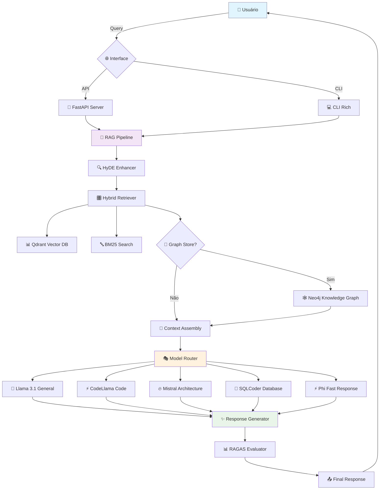

# Sistema RAG Multimodelo – Documentação Completa


> Sistema RAG (Retrieval-Augmented Generation) avançado com suporte a múltiplos modelos, búsca híbrida, 
> enriquecimento de contexto com grafo de conhecimento Neo4j, e avaliação automática de qualidade com RAGAS.

---

## 🎯 Visão Geral

O projeto implementa um **sistema RAG empresarial** com as seguintes capacidades:

### ✨ Recursos Principais

- 🔍 **Busca Híbrida**: Combinação de busca vetorial (Qdrant) e BM25
- 🧠 **Roteamento Inteligente**: Múltiplos modelos LLM especializados por tarefa
- 📊 **Grafo de Conhecimento**: Enriquecimento de contexto com Neo4j
- 🎛️ **HyDE**: Hypothetical Document Embeddings para melhor retrieval
- 📈 **Avaliação RAGAS**: Métricas automáticas de qualidade
- 🚀 **API REST**: Endpoints completos para integração
- 💻 **CLI Avançada**: Interface de linha de comando rica
- 🐳 **Containerização**: Deploy completo com Docker Compose
- 🔧 **Monitoramento**: Prometheus + Grafana integrados

### 🏗️ Arquitetura



---

## 🚀 Instalação Rápida

### Opção 1: Docker Compose (Recomendado)

   ```bash
# 1. Clone o repositório
git clone https://github.com/seu-usuario/llm-rag-system.git
cd llm-rag-system

# 2. Configure variáveis de ambiente
cp config/env_example.txt .env
# Edite .env com suas chaves de API

# 3. Inicie todos os serviços
docker-compose up -d

# 4. Aguarde inicialização (30s)
docker-compose logs -f rag-app

# 5. Acesse a API
curl http://localhost:8000/health
```

### Opção 2: Instalação Local

   ```bash
# 1. Ambiente virtual
python -m venv .venv
source .venv/bin/activate  # Linux/macOS
# .venv\Scripts\activate    # Windows

# 2. Dependências
pip install -r requirements.txt

# 3. Configuração
cp config/env_example.txt .env
# Configure OPENAI_API_KEY e NEO4J_PASSWORD

# 4. Serviços externos (Qdrant + Neo4j)
docker-compose up -d qdrant neo4j

# 5. Execute a aplicação
uvicorn src.api.main:app --host 0.0.0.0 --port 8000 --reload
```

---

## ⚙️ Configuração Avançada

### 📂 Arquivo de Configuração Principal

O sistema utiliza `config/config.yaml` para todas as configurações:

```yaml
# config/config.yaml
llm:
  routing_mode: advanced  # simple | advanced
  models:
    general:
      name: llama3.1:8b-instruct-q4_K_M
      tasks: [general_explanation, documentation]
    code:
      name: codellama:7b-instruct
      tasks: [code_generation, debugging]
    
vectordb:
  type: qdrant
  host: localhost
  port: 6333
  
hyde:
  enabled: true
  num_hypothetical_docs: 3
  
evaluation:
  enabled: true
  auto_evaluation: true
  sample_rate: 0.1
```

### 🔑 Variáveis de Ambiente

```bash
# .env
OPENAI_API_KEY=sk-...
ANTHROPIC_API_KEY=sk-ant-...
NEO4J_PASSWORD=sua-senha-segura
QDRANT_HOST=localhost
ENVIRONMENT=development
```

---

## 📡 API REST

### 🔄 Endpoints Principais

| Método | Endpoint | Descrição |
|--------|----------|-----------|
| `POST` | `/query` | Consulta principal com modo híbrido |
| `POST` | `/query_with_code` | Consulta focada em código |
| `POST` | `/add_documents` | Adicionar documentos |
| `POST` | `/upload` | Upload de arquivos |
| `GET` | `/stats` | Estatísticas do sistema |
| `GET` | `/health` | Health check |

### 📋 Exemplos de Uso

#### Consulta Básica
```bash
curl -X POST "http://localhost:8000/query" \
  -H "Content-Type: application/json" \
  -d '{
    "question": "Como implementar autenticação JWT?",
    "k": 5,
    "use_hybrid": true
  }'
```

#### Consulta com Código
```bash
curl -X POST "http://localhost:8000/query_with_code" \
  -H "Content-Type: application/json" \
  -d '{
    "question": "Exemplo de classe Python para conectar ao banco",
    "k": 3
  }'
```

#### Upload de Documento
```bash
curl -X POST "http://localhost:8000/upload" \
  -F "file=@documento.pdf"
```

### 📊 Estrutura de Resposta

```json
{
  "answer": "Resposta gerada pelo LLM...",
  "sources": [
    {
      "content": "Texto do documento...",
      "metadata": {
        "filename": "arquivo.py",
        "source": "local"
      },
      "score": 0.85
    }
  ],
  "model": "llama3.1:8b-instruct-q4_K_M",
  "models_used": ["llama3.1", "codellama"],
  "strategy": "hybrid_routing",
  "needs_code": true
}
```

---

## 💻 Interface CLI

### 🎨 Comandos Disponíveis

```bash
# Instalar CLI
pip install -e .

# Consulta interativa
rag-cli query "O que é machine learning?" --k 5 --hybrid

# Indexar documentos
rag-cli index documento1.pdf documento2.py --chunking semantic

# Upload de arquivo
rag-cli upload arquivo.pdf

# Busca por código
rag-cli code "Como fazer autenticação JWT em FastAPI"

# Informações do sistema
rag-cli info

# Estatísticas
rag-cli stats

# Limpar índice
rag-cli clear

# Demo interativo
rag-cli demo
```

### 🎯 Exemplos Práticos

```bash
# Consulta com output rico
rag-cli query "Explain dependency injection" --rich

# Consulta apenas LLM (sem busca)
rag-cli query "What is Python?" --llm-only

# Indexação com chunking semântico
rag-cli index docs/ --chunking semantic --chunk-size 1000

# Output JSON para integração
rag-cli query "FastAPI tutorial" --json-output
```

---

## 🐳 Docker e Deploy

### 🏗️ Estrutura de Serviços

```yaml
services:
  rag-app:          # Aplicação principal
  qdrant:           # Banco vetorial
  neo4j:            # Grafo de conhecimento
  prometheus:       # Monitoramento
  grafana:          # Dashboards
  nginx:            # Proxy reverso (produção)
```

### 🚀 Comandos Docker

```bash
# Desenvolvimento
docker-compose up -d

# Produção
docker-compose --profile production up -d

# Apenas testes
docker-compose --profile testing up rag-tests

# Logs em tempo real
docker-compose logs -f rag-app

# Reiniciar serviço específico
docker-compose restart rag-app

# Limpar volumes
docker-compose down -v
```

### 📊 Monitoramento

- **Grafana**: http://localhost:3000 (admin/admin)
- **Prometheus**: http://localhost:9090
- **Neo4j Browser**: http://localhost:7474
- **Qdrant Dashboard**: http://localhost:6333/dashboard

---

## 🧩 Componentes Principais

### 📁 Estrutura de Código

```
src/
├── api/                 # FastAPI endpoints
├── cli/                 # Interface linha de comando
├── chunking/            # Estratégias de chunking
├── embeddings/          # Serviços de embedding
├── vectordb/            # Qdrant integration
├── graphdb/             # Neo4j integration
├── retrieval/           # Hybrid retrieval + HyDE
├── models/              # Model routing
├── monitoring/          # RAGAS evaluation
├── utils/               # Utilitários
└── prompts/             # Sistema de prompts
```

### 🔧 Configuração por Componente

#### Chunking Inteligente
```python
chunking:
  method: advanced
  adaptive_chunking:
    code:
      chunk_size: 1024
      chunk_overlap: 100
    documentation:
      chunk_size: 512
      chunk_overlap: 50
```

#### Roteamento de Modelos
```python
llm:
  routing_mode: advanced
  models:
    general: { name: "llama3.1:8b", tasks: ["general"] }
    code: { name: "codellama:7b", tasks: ["code_generation"] }
    sql: { name: "sqlcoder:7b", tasks: ["sql_query"] }
```

---

## 🎛️ Funcionalidades Avançadas

### 🔮 HyDE (Hypothetical Document Embeddings)

Melhora a qualidade da busca gerando documentos hipotéticos:

```python
# Configuração
hyde:
  enabled: true
  num_hypothetical_docs: 3
  embedding_strategy: "weighted"

# Uso via API
{
  "question": "Como implementar cache Redis?",
  "use_hyde": true
}

# Uso via CLI
rag-cli query "Redis caching patterns" --hyde
```

### 📊 RAGAS - Avaliação Automática

Framework para avaliar qualidade das respostas:

```python
from src.monitoring.rag_evaluator import RAGEvaluator

evaluator = RAGEvaluator()
result = await evaluator.evaluate_single(test_case)

print(f"Score geral: {result.overall_score:.3f}")
print(f"Faithfulness: {result.faithfulness:.3f}")
print(f"Answer Relevancy: {result.answer_relevancy:.3f}")
```

### 🕸️ Grafo de Conhecimento Neo4j

Enriquecimento de contexto com relacionamentos:

```python
# Habilitando grafo
config:
  use_graph_store: true
  neo4j_uri: "bolt://localhost:7687"

# Busca expandida
result = pipeline.query(
    "Padrões de arquitetura", 
    use_graph=True,
    expand_context=2  # níveis de expansão
)
```

---

## 🧪 Testes e Qualidade

### 🔬 Executando Testes

```bash
# Todos os testes
pytest tests/ -v

# Com coverage
pytest tests/ --cov=src --cov-report=html

# Testes específicos
pytest tests/test_rag_pipeline.py -v

# Benchmarks de performance
pytest tests/test_performance.py --benchmark-only

# Testes via Docker
docker-compose --profile testing up rag-tests
```

### 📈 Benchmarks

```bash
# Script de benchmark
python scripts/test_hybrid_performance.py

# Teste HyDE + RAGAS
python examples/hyde_ragas_example.py

# Validação completa do sistema
python scripts/validate_system.py
```

---

## 📚 Exemplos Práticos

### 🎯 Uso Básico

```python
from src.rag_pipeline import RAGPipeline

# Inicialização
pipeline = RAGPipeline(config_path="config/config.yaml")

# Consulta simples
resposta = pipeline.query("O que é FastAPI?", k=5)
print(resposta["answer"])

# Com HyDE
resposta = pipeline.query(
    "Implementar autenticação JWT", 
    use_hyde=True
)
```

### 🎨 Integração com Cliente

```python
from src.client.rag_client import RAGClient

client = RAGClient(base_url="http://localhost:8000")

# Consulta
result = client.query("Padrões de design Python")

# Upload de documento
client.upload_file("documento.pdf")

# Indexação
client.index_documents(["arquivo1.py", "arquivo2.md"])
```

### 🔧 Configuração Customizada

```python
# Pipeline customizado
config = {
    "llm": {
        "routing_mode": "advanced",
        "models": {
            "custom": {
                "name": "seu-modelo:tag",
                "tasks": ["custom_task"]
            }
        }
    },
    "hyde": {"enabled": True},
    "evaluation": {"auto_evaluation": True}
}

pipeline = RAGPipeline(config=config)
```

---

## 🔧 Troubleshooting

### ❗ Problemas Comuns

#### Erro de Conexão com Qdrant
```bash
# Verificar status
docker-compose ps qdrant

# Logs
docker-compose logs qdrant

# Reiniciar
docker-compose restart qdrant
```

#### Modelos Ollama Não Encontrados
```bash
# Instalar modelo
ollama pull llama3.1:8b-instruct-q4_K_M
ollama pull codellama:7b-instruct

# Verificar modelos disponíveis
ollama list
```

#### Neo4j Autenticação
```bash
# Resetar senha
docker-compose exec neo4j cypher-shell -u neo4j -p neo4j
# No shell: ALTER USER neo4j SET PASSWORD 'nova-senha';
```

### 🩺 Health Checks

```bash
# API health
curl http://localhost:8000/health

# Qdrant health
curl http://localhost:6333/health

# Neo4j status
curl http://localhost:7474/db/data/

# Verificação completa
python scripts/validate_system.py
```

---

## 📊 Métricas e Monitoramento

### 📈 Dashboards Grafana

1. **RAG System Overview**: Métricas gerais do sistema
2. **Query Performance**: Latência e throughput de consultas
3. **Model Usage**: Utilização e performance dos modelos
4. **RAGAS Scores**: Qualidade das respostas ao longo do tempo

### 🎯 Métricas Principais

- **Latência**: Tempo de resposta por query
- **Throughput**: Queries por segundo
- **Cache Hit Rate**: Taxa de acerto do cache
- **Model Accuracy**: Score RAGAS médio
- **Error Rate**: Taxa de erro das operações

---

## 🚦 Roadmap

### ✅ Implementado
- [x] Sistema RAG básico com Qdrant
- [x] Roteamento inteligente de modelos
- [x] HyDE para melhor retrieval
- [x] Framework RAGAS para avaliação
- [x] API REST completa
- [x] CLI rica com Rich
- [x] Deploy com Docker Compose
- [x] Monitoramento com Prometheus/Grafana

### 🔄 Em Desenvolvimento
- [ ] Interface Web (Streamlit/Gradio)
- [ ] Cache inteligente multi-layer
- [ ] Auto-tuning de parâmetros
- [ ] Integração com mais vector DBs

### 🎯 Planejado
- [ ] Suporte a multimodal (imagens/vídeos)
- [ ] Deploy em Kubernetes
- [ ] Marketplace de prompts
- [ ] A/B testing automático

---

## 🤝 Contribuição

1. **Fork** o projeto
2. **Crie** uma branch para sua feature (`git checkout -b feature/AmazingFeature`)
3. **Commit** suas mudanças (`git commit -m 'Add some AmazingFeature'`)
4. **Push** para a branch (`git push origin feature/AmazingFeature`)
5. **Abra** um Pull Request

### 📋 Guidelines

- Use **Black** para formatação: `black src/`
- Execute **testes**: `pytest tests/`
- Documente **mudanças** no README
- Siga **conventional commits**

---

## 📄 Licença

Este projeto está licenciado sob a MIT License - veja o arquivo [LICENSE](LICENSE) para detalhes.

---

## 🙏 Agradecimentos

- **Ollama** - Local LLM inference
- **Qdrant** - Vector database
- **Neo4j** - Graph database
- **FastAPI** - API framework
- **RAGAS** - RAG evaluation framework

---

&copy; 2024 – Sistema RAG Multimodelo | Desenvolvido com ❤️ para a comunidade