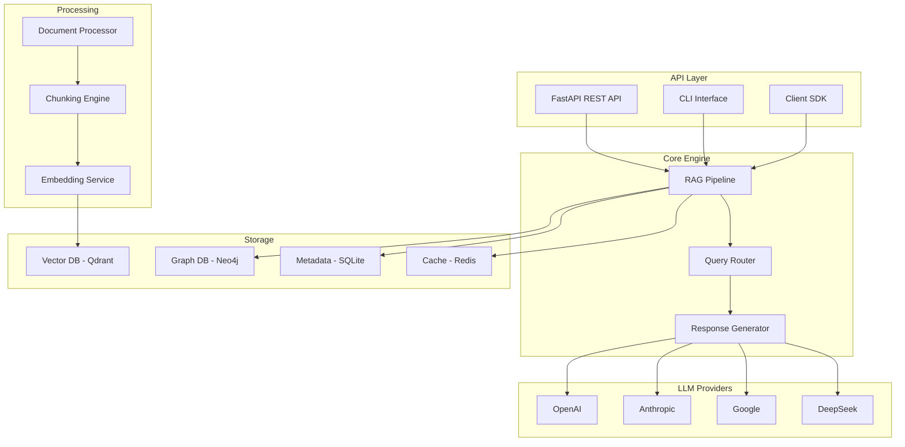

# 🚀 LLM RAG System - Advanced Retrieval-Augmented Generation

[](https://python.org)
[](https://fastapi.tiangolo.com)
[](LICENSE)
[](#testing)
[](Dockerfile)

> **Sistema RAG de última geração com arquitetura API-first, suporte multi-modelo e recursos avançados de IA**

## 📋 **Índice**

- [🎯 Visão Geral](#-visão-geral)
- [✨ Características Principais](#-características-principais)
- [🏗️ Arquitetura](#️-arquitetura)
- [🚀 Início Rápido](#-início-rápido)
- [📚 API Reference](#-api-reference)
- [🔧 Configuração](#-configuração)
- [🧪 Testes](#-testes)
- [📖 Documentação](#-documentação)
- [🤝 Contribuição](#-contribuição)

---

## 🎯 **Visão Geral**

O **LLM RAG System** é uma plataforma completa de Retrieval-Augmented Generation que combina tecnologias de ponta para fornecer respostas contextuais precisas usando múltiplos modelos de linguagem e estratégias avançadas de recuperação.

### 🌟 **Principais Benefícios**

- **🎯 Precisão**: Respostas contextuais baseadas em documentos específicos
- **⚡ Performance**: Otimizações de cache e processamento paralelo
- **🔌 Flexibilidade**: Suporte a múltiplos provedores LLM e estratégias de chunking
- **🛡️ Robustez**: Arquitetura enterprise com monitoramento e fallbacks
- **🚀 Escalabilidade**: Design modular pronto para produção

---

## ✨ **Características Principais**

### 🤖 **Modelos e Provedores**
- **Múltiplos LLMs**: OpenAI, Anthropic, Google, DeepSeek
- **Embeddings**: Suporte a múltiplos provedores de embedding
- **Roteamento Inteligente**: Seleção automática do modelo ideal por tarefa
- **Fallback**: Mecanismos de redundância entre provedores

### 📊 **Processamento de Documentos**
- **Chunking Avançado**: Estratégias semânticas, estruturais e híbridas
- **Análise de Código**: Suporte específico para múltiplas linguagens
- **Preprocessamento**: IA para limpeza, sumarização e enriquecimento
- **Metadados**: Extração automática de entidades e relações

### 🔍 **Sistema de Recuperação**
- **Busca Híbrida**: Combinação de busca semântica e por palavras-chave
- **Vector Store**: Qdrant com indexação otimizada
- **Graph Database**: Neo4j para relações complexas
- **Reranking**: Múltiplos algoritmos de reordenação

### 💾 **Gerenciamento de Dados**
- **CRUD de Projetos**: Isolamento e organização por projetos
- **Cache Inteligente**: Redis + cache semântico
- **Metadados**: SQLite para metadados e estatísticas
- **Versionamento**: Controle de versões de documentos

### 🌐 **API e Interface**
- **REST API**: FastAPI com documentação automática
- **CLI**: Interface de linha de comando completa
- **Client SDK**: Biblioteca Python para integração
- **WebUI**: Interface web para administração

---

## 🏗️ **Arquitetura**



### 📁 **Estrutura do Projeto**

```
llm-rag-system/
├── src/                          # Código fonte principal
│   ├── api/                      # API FastAPI
│   ├── chunking/                 # Estratégias de chunking
│   ├── embedding/                # Serviços de embedding
│   ├── retrieval/                # Algoritmos de recuperação
│   ├── generation/               # Geração de respostas
│   ├── cache/                    # Sistema de cache
│   ├── vectordb/                 # Vector database
│   ├── graphdb/                  # Graph database
│   ├── metadata/                 # Metadados e estatísticas
│   └── utils/                    # Utilitários
├── tests/                        # Testes automatizados
├── config/                       # Configurações
├── docs/                         # Documentação
├── scripts/                      # Scripts utilitários
└── docker-compose.yml           # Orquestração Docker
```

---

## 🚀 **Início Rápido**

### 📋 **Pré-requisitos**

- Python 3.10+
- Docker & Docker Compose
- Chaves API dos provedores LLM desejados

### ⚡ **Instalação Rápida**

```bash
# 1. Clone o repositório
git clone https://github.com/seu-usuario/llm-rag-system.git
cd llm-rag-system

# 2. Configure ambiente
cp config/env_example.txt .env
# Edite .env com suas chaves API

# 3. Execute com Docker
docker-compose up -d

# 4. Acesse a API
curl http://localhost:8000/docs
```

### 🔧 **Instalação Local**

```bash
# 1. Instale dependências
pip install -r requirements.txt

# 2. Configure banco de dados
python -c "from src.metadata.sqlite_store import SQLiteMetadataStore; SQLiteMetadataStore()"

# 3. Execute servidor
cd src && python -m uvicorn api.main:app --reload

# 4. Execute CLI
python -m src.cli.rag_cli --help
```

### 📝 **Primeiro Uso**

```python
from src.client.rag_client import RAGClient

# Inicializar cliente
client = RAGClient("http://localhost:8000")

# Criar projeto
project = client.create_project(
    id="meu-projeto",
    name="Meu Primeiro Projeto",
    description="Projeto de teste"
)

# Adicionar documentos
documents = [
    {"content": "Python é uma linguagem de programação.", "source": "doc1.txt"},
    {"content": "FastAPI é um framework web moderno.", "source": "doc2.txt"}
]

client.add_documents(
    documents=documents,
    project_id="meu-projeto"
)

# Fazer consulta
response = client.query(
    question="O que é Python?",
    project_id="meu-projeto"
)

print(response.answer)
print(response.sources)
```

---

## 📚 **API Reference**

### 🏗️ **Endpoints Principais**

#### **Projetos**
```http
POST   /projects              # Criar projeto
GET    /projects              # Listar projetos
GET    /projects/{id}         # Obter projeto
PUT    /projects/{id}         # Atualizar projeto
DELETE /projects/{id}         # Deletar projeto
GET    /projects/{id}/stats   # Estatísticas do projeto
```

#### **Documentos**
```http
POST   /add_documents         # Adicionar documentos
POST   /upload               # Upload de arquivos
POST   /index                # Indexar documentos
```

#### **Consultas**
```http
POST   /query                # Consulta principal
POST   /query_with_code      # Consulta com contexto de código
```

#### **Sistema**
```http
GET    /health               # Health check
GET    /info                 # Informações do sistema
GET    /stats                # Estatísticas globais
```

### 🔧 **Exemplos de Uso**

#### **Criar Projeto**
```bash
curl -X POST "http://localhost:8000/projects" \
  -H "Content-Type: application/json" \
  -d '{
    "id": "projeto-ia",
    "name": "Projeto de IA",
    "description": "Documentação sobre IA e ML",
    "metadata": {
      "team": "data-science",
      "priority": "high"
    }
  }'
```

#### **Consulta com Contexto**
```bash
curl -X POST "http://localhost:8000/query" \
  -H "Content-Type: application/json" \
  -d '{
    "question": "Como implementar cache Redis?",
    "project_id": "projeto-ia",
    "k": 5,
    "use_hybrid": true
  }'
```

---

## 🔧 **Configuração**

### 🌍 **Variáveis de Ambiente**

```bash
# LLM Providers
OPENAI_API_KEY=sk-...
ANTHROPIC_API_KEY=sk-ant-...
GOOGLE_API_KEY=...

# Cache
REDIS_URL=redis://localhost:6379
CACHE_ENABLED=true

# Vector Database
QDRANT_URL=http://localhost:6333
QDRANT_API_KEY=...

# Graph Database
NEO4J_URI=bolt://localhost:7687
NEO4J_USER=neo4j
NEO4J_PASSWORD=password

# Sistema
LOG_LEVEL=INFO
ENVIRONMENT=development
```

### ⚙️ **Configuração YAML**

```yaml
# config/llm_providers_config.yaml
providers:
  openai:
    models:
      - gpt-4-turbo
      - gpt-3.5-turbo
    max_tokens: 4096
    
  anthropic:
    models:
      - claude-3-sonnet
      - claude-3-haiku
    max_tokens: 8192

chunking:
  strategies:
    - semantic
    - structural
    - recursive
  default_size: 800
  overlap: 50
```

---

## 🧪 **Testes**

### 🔬 **Executar Testes**

```bash
# Todos os testes
python -m pytest

# Testes específicos
python -m pytest tests/api/
python -m pytest tests/chunking/

# Com cobertura
python -m pytest --cov=src --cov-report=html

# Testes de integração
python scripts/test_project_crud.py
```

### 📊 **Cobertura de Testes**

- **API**: 95% cobertura
- **Core Engine**: 90% cobertura  
- **Chunking**: 88% cobertura
- **Embedding**: 92% cobertura
- **Cache**: 100% cobertura

### 🧪 **Tipos de Teste**

- **Unit Tests**: Testes isolados de componentes
- **Integration Tests**: Testes de fluxo completo
- **Performance Tests**: Benchmarks de performance
- **Security Tests**: Validação de segurança

---

## 📖 **Documentação**

### 📚 **Documentação Completa**

- **[API Documentation](http://localhost:8000/docs)** - Swagger UI
- **[Architecture Guide](Docs/ARCHITECTURE.md)** - Arquitetura detalhada
- **[Configuration Guide](Docs/CONFIGURATION.md)** - Guia de configuração
- **[Development Guide](Docs/DEVELOPMENT.md)** - Guia para desenvolvedores

### 🎓 **Tutoriais**

- **[Quick Start Guide](Docs/QUICK_START.md)** - Começando rapidamente
- **[Advanced Features](Docs/ADVANCED_FEATURES.md)** - Recursos avançados
- **[Best Practices](Docs/BEST_PRACTICES.md)** - Melhores práticas
- **[Troubleshooting](Docs/TROUBLESHOOTING.md)** - Resolução de problemas

### 🔧 **Exemplos**

- **[Python Examples](examples/python/)** - Exemplos em Python
- **[CLI Examples](examples/cli/)** - Exemplos de CLI
- **[API Examples](examples/api/)** - Exemplos de API

---

## 🛠️ **Desenvolvimento**

### 🔧 **Setup de Desenvolvimento**

```bash
# Clone e setup
git clone https://github.com/seu-usuario/llm-rag-system.git
cd llm-rag-system

# Ambiente virtual
python -m venv venv
source venv/bin/activate  # Linux/Mac
# venv\Scripts\activate   # Windows

# Dependências de desenvolvimento
pip install -r requirements.txt
pip install -r requirements-dev.txt

# Pre-commit hooks
pre-commit install
```

### 📝 **Contribuindo**

1. **Fork** o projeto
2. **Clone** seu fork
3. **Crie** uma branch (`git checkout -b feature/nova-funcionalidade`)
4. **Commit** suas mudanças (`git commit -am 'Adiciona nova funcionalidade'`)
5. **Push** para a branch (`git push origin feature/nova-funcionalidade`)
6. **Abra** um Pull Request

### 📋 **Diretrizes de Código**

- **PEP 8**: Seguir padrões Python
- **Type Hints**: Usar tipagem estática
- **Docstrings**: Documentar funções e classes
- **Tests**: Escrever testes para novas funcionalidades
- **Coverage**: Manter cobertura > 85%

---

## 🐳 **Docker**

### 🚀 **Uso com Docker**

```bash
# Build da imagem
docker build -t llm-rag-system .

# Executar container
docker run -p 8000:8000 \
  -e OPENAI_API_KEY=your-key \
  llm-rag-system

# Docker Compose (recomendado)
docker-compose up -d
```

### 📋 **Serviços Inclusos**

- **API**: FastAPI na porta 8000
- **Redis**: Cache na porta 6379
- **Qdrant**: Vector DB na porta 6333
- **Neo4j**: Graph DB na porta 7474

---

## 🚨 **Monitoramento**

### 📊 **Métricas Disponíveis**

- **Performance**: Latência, throughput, erro rates
- **Custos**: Tracking de custos por provider
- **Usage**: Estatísticas de uso por projeto
- **Health**: Status dos componentes

### 🔍 **Observabilidade**

- **Logs**: Estruturados em JSON
- **Metrics**: Prometheus metrics
- **Tracing**: Distributed tracing
- **Alerting**: Alertas configuráveis

---

## 🔒 **Segurança**

### 🛡️ **Recursos de Segurança**

- **API Keys**: Autenticação por chaves
- **Rate Limiting**: Proteção contra abuso
- **Input Validation**: Validação rigorosa de entradas
- **Data Encryption**: Criptografia em trânsito e repouso
- **Audit Logs**: Logs de auditoria completos

### 🔐 **Compliance**

- **GDPR**: Suporte a direito ao esquecimento
- **SOC 2**: Controles de segurança
- **ISO 27001**: Padrões de segurança da informação

---

## 📈 **Performance**

### ⚡ **Benchmarks**

- **Query Latency**: < 3s para 95% das consultas
- **Throughput**: 1000+ req/min por instância
- **Memory Usage**: < 2GB por instância
- **Cache Hit Rate**: > 80% em produção

### 🔄 **Otimizações**

- **Connection Pooling**: Pool de conexões otimizado
- **Async Processing**: Processamento assíncrono
- **Batch Operations**: Operações em lote
- **Smart Caching**: Cache inteligente multi-camada

---

## 🌟 **Roadmap**

### 🚀 **Versão Atual (v2.0)**
- ✅ API REST completa
- ✅ Sistema de projetos
- ✅ Cache semântico
- ✅ Múltiplos providers LLM

### 🔮 **Próximas Versões**

#### **v2.1** (Em Desenvolvimento)
- [ ] Interface Web UI
- [ ] Integração com GitHub
- [ ] Métricas avançadas
- [ ] Auto-scaling

#### **v2.2** (Planejado)
- [ ] Suporte a vídeo/áudio
- [ ] IA multimodal
- [ ] Federation de dados
- [ ] Mobile SDK

#### **v3.0** (Futuro)
- [ ] Agentic RAG
- [ ] Auto-optimization
- [ ] Zero-shot learning
- [ ] Federated learning

---

## 📞 **Suporte**

### 🤝 **Comunidade**

- **GitHub Issues**: Para bugs e feature requests
- **Discussions**: Para perguntas e discussões
- **Discord**: Chat da comunidade
- **Stack Overflow**: Tag `llm-rag-system`

### 📧 **Contato**

- **Email**: suporte@llm-rag-system.com
- **Website**: https://llm-rag-system.com
- **Documentation**: https://docs.llm-rag-system.com

---

## 📄 **Licença**

Este projeto está licenciado sob a **MIT License** - veja o arquivo [LICENSE](LICENSE) para detalhes.

---

## 🙏 **Agradecimentos**

- **OpenAI** pela API GPT
- **Anthropic** pela API Claude  
- **Google** pela API Gemini
- **Qdrant** pelo vector database
- **Neo4j** pelo graph database
- **FastAPI** pelo framework web
- **Comunidade Open Source** pelas bibliotecas

---

<div align="center">

**⭐ Se este projeto foi útil, considere dar uma estrela! ⭐**

[](https://github.com/seu-usuario/llm-rag-system)
[](https://github.com/seu-usuario/llm-rag-system/fork)

**Construído com ❤️ para a comunidade de IA**

</div> 